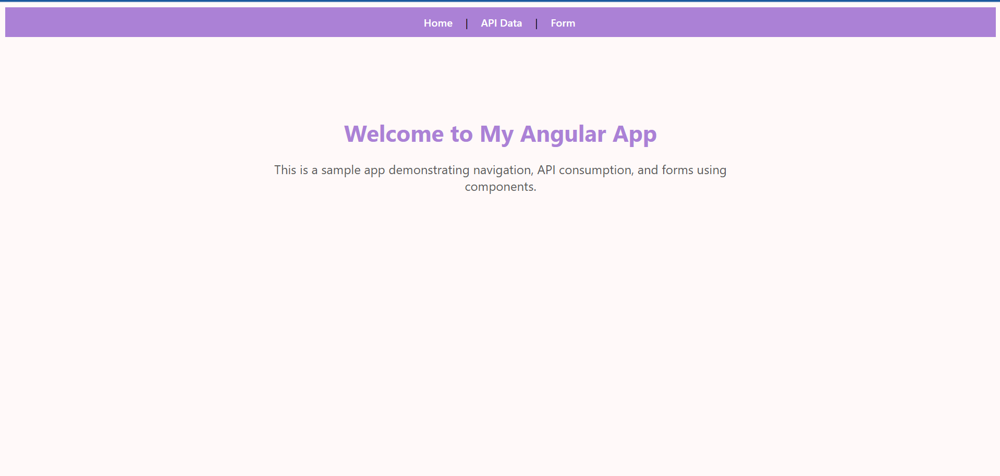
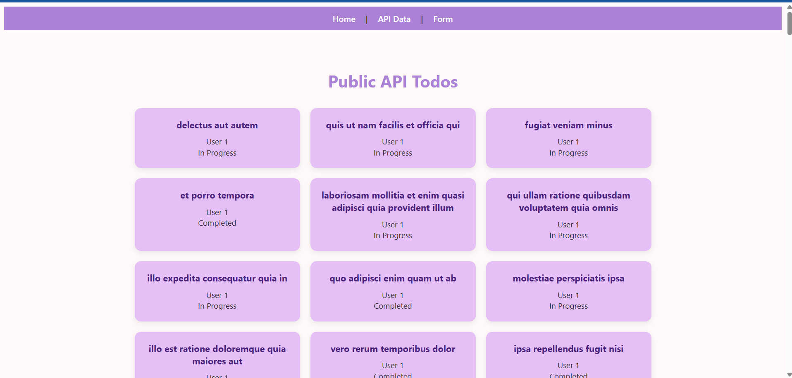
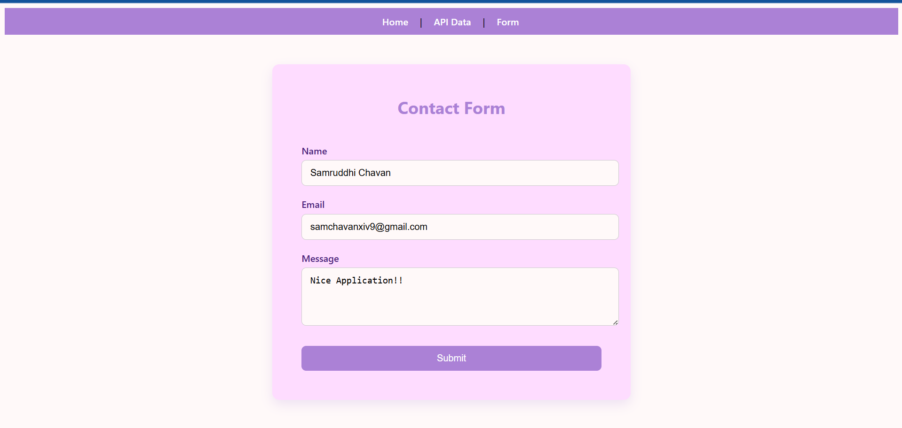

#  Angular Assignment - Samruddhi Chavan

This is a **client-side Angular 18 web application** built as part of the ITE-5425 Winter 2025 assignment. It includes:

- Navigation (Router)
- API Consumption using Angular Services + HttpClient
- Reactive Form with validations
- Custom styling
- Deployed using Vercel

---

## Deployment URL

Live application:  
[https://angular-wine-zeta.vercel.app/](https://angular-wine-zeta.vercel.app/)

---

## GitHub Repository

Source code:  
[https://github.com/2025-Winter-ITE-5425-0NB/angular-assignment-samruddhi1499.git](https://github.com/2025-Winter-ITE-5425-0NB/angular-assignment-samruddhi1499.git)

---

## How to Run Locally

### Clone the project

```bash
git clone https://github.com/2025-Winter-ITE-5425-0NB/angular-assignment-samruddhi1499.git
cd angular-assignment-samruddhi1499/my-app
```

### Install dependencies

```bash
npm install
```

### Run development server

```bash
ng serve
```

Open your browser at `http://localhost:4200` 

---

## Build for Production

```bash
ng build
```

The build output will be located in:

```
dist/my-app/browser
```

---

## Features

- Client-side routing with Angular Router
- Reactive forms with field validation
- API Data displayed using `HttpClient` (e.g., public placeholder APIs)
- Clean and minimal UI with Lavender color palette
- Responsive layout
- Deployed to Vercel with SPA routing support

---

## Screenshots

### Home Page



### API Data Page



### Form Page


